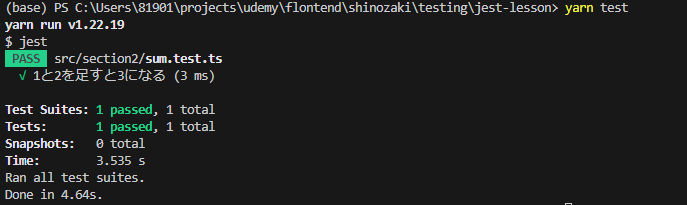
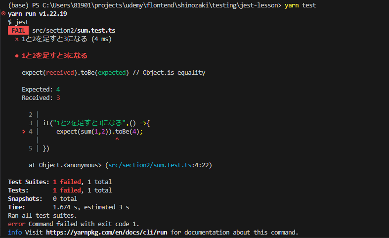

## src/section2/sum.tsを作成
- sum関数は2つの数値を受取、合計を返す単純な関数
```
export function sum(a: number, b: number): number {
  return a + b;
}

```
- section2/sum.test.tsを作成しtest関数もしくはit関数を使用する
    - importでテスト対象となるsumをインポートする
    - it関数の第一引数は文字列でテストケースの名前を指定(日本語でもOK)
    - 第二引数にはアロー関数を指定し中に具体的なテストを記述
    - expect関数の引数にテスト対象の実行結果を渡す
    - toBeメソッドはmatcher関数と呼ばれるものでexpect関数に渡した結果の期待値を渡す
    - 結果としてexpectとtoBeを組み合わせることで、sum(1,2)の結果がtoBe(3)と等しいことを期待するという意味になる

```
import { sum } from "./sum";

it("1と2を足すと3になる",() =>{
    expect(sum(1,2)).toBe(3);
})
```

- テストを実行
    - yarn testで実行することで下記の通りになれば成功
    - テストの成功は緑色で表示される
    - Test Suites:はテストファイルの合計数と成功したテストファイルの数を示している
    - Tests: はtest関数もしくはit関数で作成したテストケースの合計数と成功数
    - Snapshots:はjestのsnapshottestという機能を使ったケース数
    - Timeはテスト全体の実行時間を示している
    
    - 下記は失敗例となりtoBe(4)にして実行した結果となる
    - Expected: 4　期待値が4であるにもかかわらず、Received: 3 実行結果が3であった為失敗したということがわかる
    