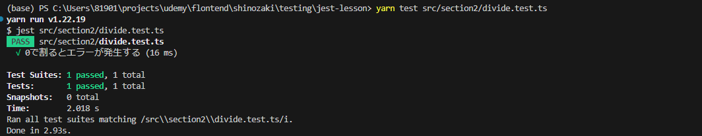

## 例外処理のテスト
- 対象ファイル　section2/divide.ts section2/divide.test.ts

- アプリケーション開発では、エラーが発生する可能性がある箇所に対して例外処理を実装することが多々あるが、それらの例外処理が正しく動作するかをテストすることは、アプリケーションの品質を担保する上で重要
- 例外処理をテストするには、toThrowというmarcherを使用する
- このmarcherはエラーをthrowするということを検証する
- 例外処理のテストではテスト対象の関数をexpectに直接渡すのではなく無名関数でラップする必要がある
- テスト対象の関数でエラーが発生するとmatcherのtoThrowが呼ばれる前に関数の実行が停止する為

- 例外が発生しテストが成功したケース
