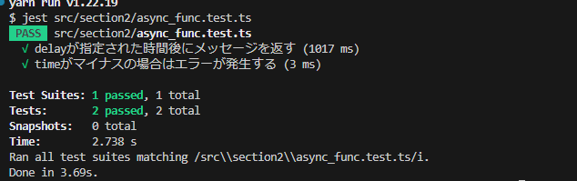

## 非同期関数のテスト
- 対象ファイル　async_func.ts (指定した時間後にメッセージを返す。delay関数が定義)

- TYPESCRIPTではWEBAPIの呼び出しや怠慢処理など非同期処理が非常に多く用いられる
- 非同期処理は、一つの処理が終了するのを待たずに次の処理が行われるという性質を持っているが、この特性はテストの世界では少し厄介なものになる
- これまで学習したように、テストを記述すると、非同期処理が完了する前にテストが評価され、テストが不適切な結果となってしまう
- この問題を解決するためには、非同期処理が完了するまでテストが待機するようにコントロールする必要があり、jestでは、非同期関数をテストするためにPromiseを使用する方法と、async awaitを使用する方法の2種類が用意されている

- 今回はモダンで簡単なasync awaitを使用する

- 非同期関数のテストでawaitをし使用する際は、it関数のコールバック関数(()=>{})にasyncをつけ、非同期関数を呼び出す際には関数の呼び出しにawaitをつける

