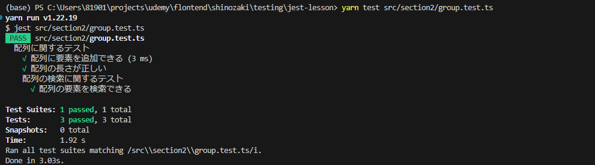

## テストのグループ化
- 対象ファイル group.test.ts

- テストケースが増えるにつれて、それらを管理しやすくするために適切に分類したり、グループ化することが重要になる

- jestではdescribe関数を用いることでテストをグループ化する事が出来る

- describe関数は2つの引数を取り、一つ目はグループの名前２つ目はグループ化したいテストケースを記述するアロー関数になる

- describe関数はネストすることが可能であり詳細なテストを行う事が出来る

- 各describeブロックが階層的なグループを形成し、その結果、レポートは階層構造を反映した形で表示される

