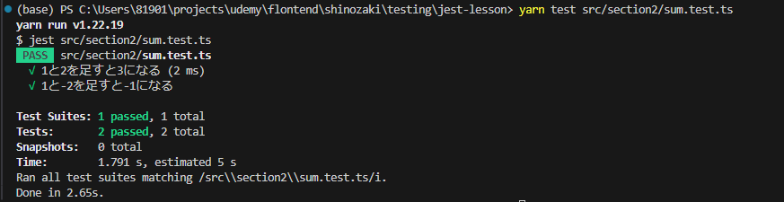

## パラメタライズドテスト
https://jestjs.io/ja/docs/api#testeachtablename-fn-timeout

- 対象ファイル　sum.test.ts

- パラメタライズドテストとは、1連の入力データとその予想結果を使って、同じテストロジックを複数回実行するテストのこと
- つまり、同じ関数またはメソッドに対して異なる入力を試したい場合や、同じロジックに対して複数のシナリオをテストしたい場合にパラメタライズドテストを使用する

- パラメタライズドテストの大きな利点は、テストケースの生成が自動化されることであり、これによりコードの重複を避けつつ様々なシナリオを容易に試すことができる

- it.each関数を使用して実装出来る

- each関数にパラメーターを渡す方法はいくつかありますが、ここでは一番直感的かつシンプルなテンプレートリテラルを使用する

- テンプレートリテラルの１行目にテストの中で扱いたい変数を記述
- 変数の区切り文字には縦棒パイプを使用
- 2行目以降で実際にテストで使用される値を定義
- 値の定義には、テンプレートリテラルのプレースホルダーである${}使用
- パラメーターの1行1行が独立したテストケースとして実行される

- テストケース名の変数の部分が実際の値と置き換えられていることがわかる
