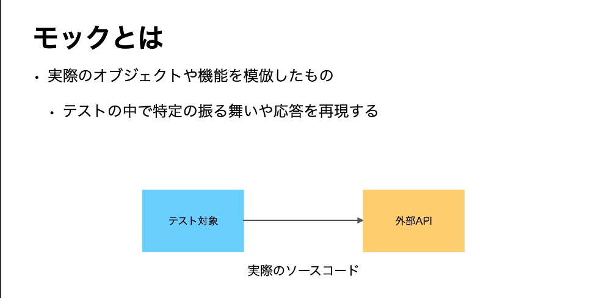
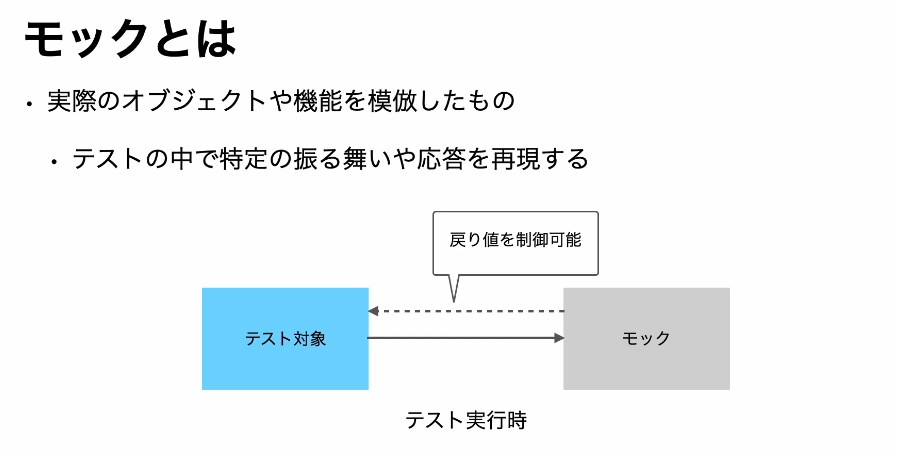
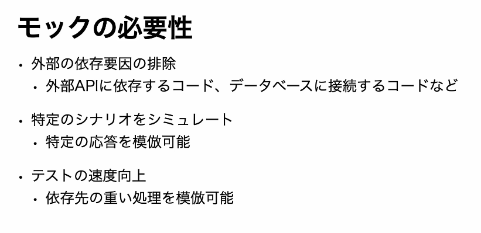
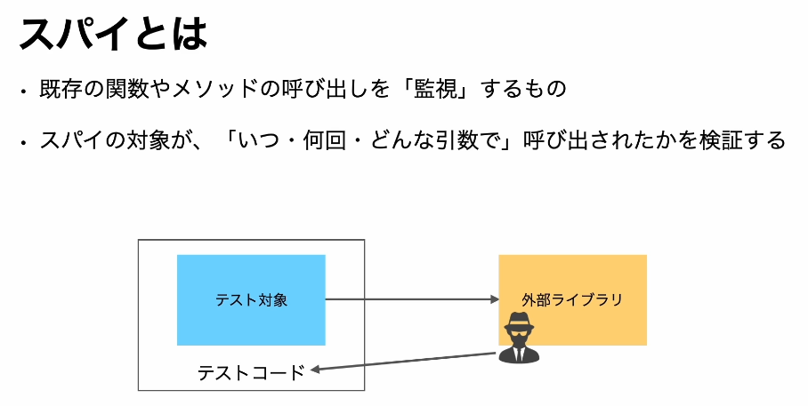
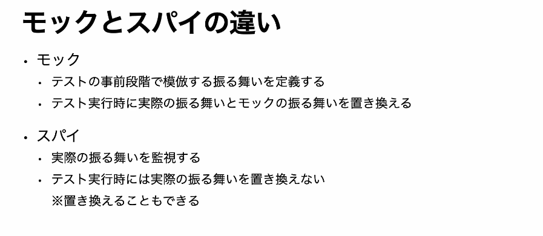

## モックとは

- 外部のAPIやデータベースとのやりとりがテスト対象の重要な部分となっている場面を例とする
- テスト時に実際のAPIやデータベースとの通信を行うことはいろいろな要因で難しく、また一貫性のあるテスト結果を得ることが難しい場合がある

- このような状況下でモックが役立つ
- テスト実行時には、このように実際のAPIの代わりにモックを利用することで、任意の戻り値やふるまいを再現し、テスト対象の振る舞いを正確に確認することができます。

- テストでモックを使用すべき理由は様々あるが、その中でも特に重要な点を解説
    - モックを使用することで、外部の依存要因を排除する
    - モックを利用することで、特定のシナリオをシミュレートしやすくなる
    - モックの利用は、テストの実行速度向上にもつながる
    

## スパイとは
- 関数やメソッドの実際の呼び出しを監視する特性
- この監視により、その関数がいつどれだけの関数で、どのような引数を持って呼び出されたかを詳細に知ることができる

- あるコードが外部のライブラリやフレームワークの特定のメソッドに依存している場合、そのメソッドの呼び出しをスパイを使って監視することができる

- このようにスパイを活用することで、テスト対象の高度と外部の高度がどのように連携しているか、その詳細を検証することができる

- モックとスパイは似ているようで、その使い方や目的には明確な違いがある
- モックは、テストを行う前の準備段階で、特定の振る舞いや戻り値を定義します。
    - モックを使用することで、テスト実行時に特定の関数やメソッドの実際の振る舞いをモックで定義した振る舞いに置き換えることができる
- スパイは、関数やメソッドの実際の振る舞いを監視するものです。
    - スパイを使用すると、関数がいつ、何回、どのような引数で呼び出されたかといった情報を取得することができる

- 重要な点として、スパイは基本的には実際の振る舞いを置き換えない
- しかし、jestではモックとスパイの機能が一部オーバーラップしています。
- そのため、jestのモック関数では、関数の呼び出しをスパイすることができるだけではなく、必要に応じてその振る舞いも置き換えることが可能

- これらの違いを理解し、テストの状況や要求に応じて適切にモックやSPYを使用することが重要

