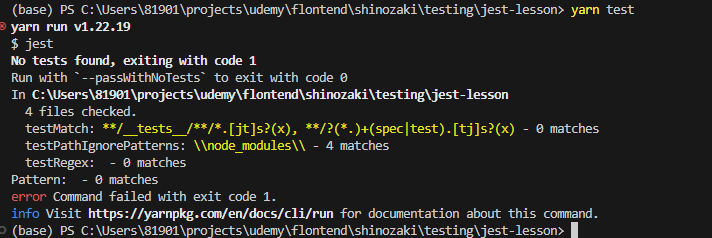

## インストール
- 1.node.jsのプロジェクトを初期化しpackage.jsonが作成される
```
ターミナル上で
npm init -y
```
- 2.Typescriptをインストール
```
npm i -D typescript
```

- 3.tsconfig.jsonを作成
```
yarn tsc --init
```

- 4.jestとjestの型定義、さらにjestでTypescriptのコードをテストするのに必要なts-jestをインストール
```
npm i -D jest @types/jest ts-jest
```

- 5.上記で必要なライブラリは完了だが、jestはそのままではtypescriptを直接テスト出来ない為、追加の設定を行う必要があり下記コマンドでjest.config.jsを作成
```
yarn ts-jest config:init
```

- 6.jest.config.jsのtestEnvironmentはjestがどの実行環境でテストを行うか指定されている

```
/** @type {import('ts-jest').JestConfigWithTsJest} **/
module.exports = {
  testEnvironment: "node",
  transform: {
    "^.+.tsx?$": ["ts-jest",{}],
  },
};

```

- 7.package.jsonにscriptのtestをjestに変更しtest用コマンドを追加
```
{
  "name": "jest-lesson",
  "version": "1.0.0",
  "description": "",
  "main": "index.js",
  "scripts": {
    "test": "jest"
  },
  "keywords": [],
  "author": "",
  "license": "ISC",
  "devDependencies": {
    "@types/jest": "^29.5.12",
    "jest": "^29.7.0",
    "ts-jest": "^29.2.2",
    "typescript": "^5.5.3"
  }
}


```
- 8.yarn testで下記の画像の通りになればセットアップは完了

