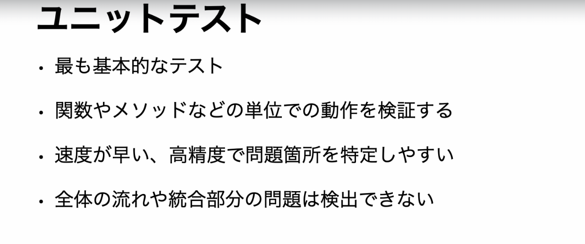
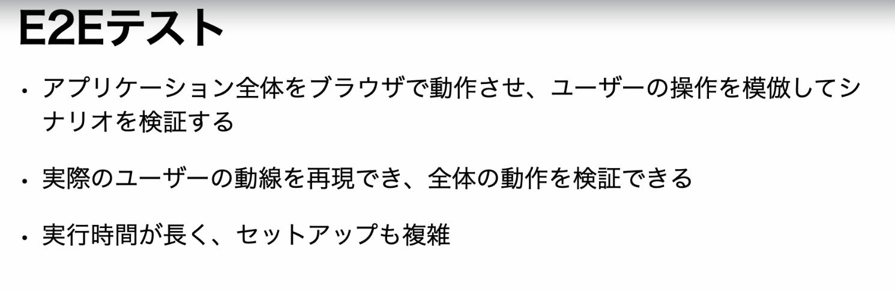
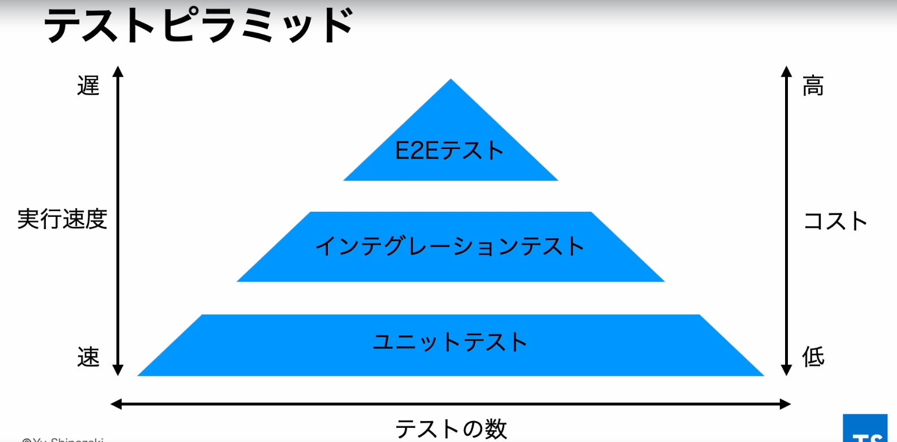
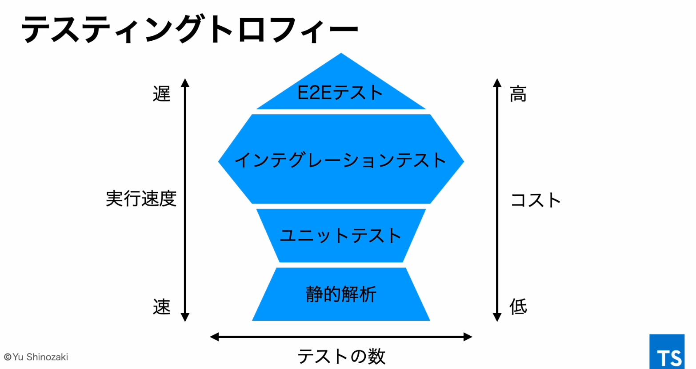

## ユニットテスト


## 結合テスト
- ユニットテストの弱点を補う


## E2Eテスト


## テスト戦略
- プロジェクトの規模や状況に応じて最適なテスト実施の方向性を決めること

- テストピラミッド
- 自動テストの各種類の割合や重要性をピラミッドの形で視覚的に示したモデル


- テスティングトロフィー
- 主にフロントエンドアプリケーションにおける自動テストの各種類の割合や重要性を示すモデル


## testコマンド
```
テストを全て実行
yarn test

指定したファイルのみテストを実行
yarn test src/section2/sum.test.ts

```